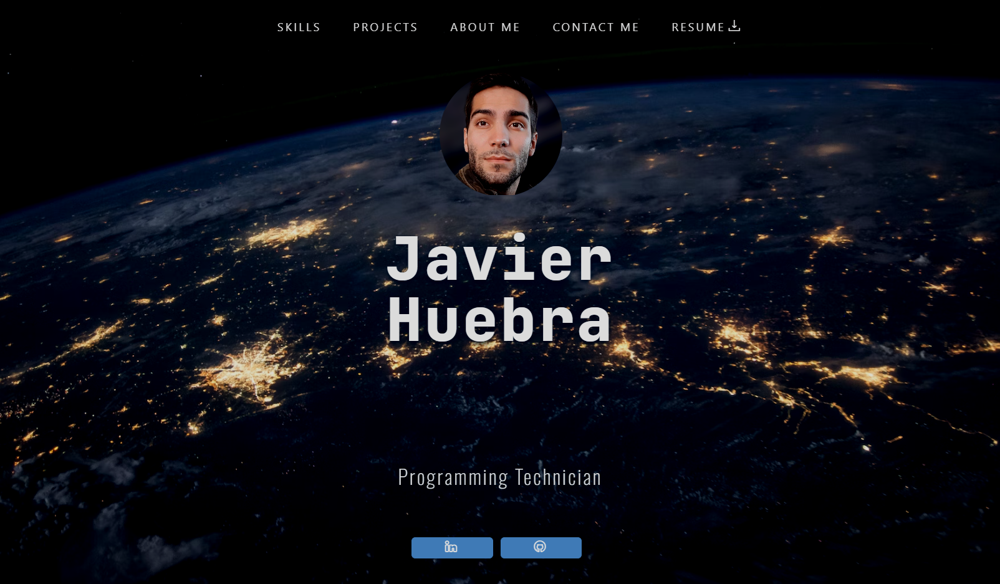

<h1 align="center">
  
</h1>

  <h2 align="center"> Web and Mobile applications - Full Stack Java</h2
   
 

 

  

  
  <a href="https://javierhuebra.github.io/Portfolio/">
     
    SEE MY PORTFOLIO
  </a>

# Education

### Currently studying higher technical degree in programming at <a href="https://www.teclab.edu.ar">technological Institute TecLab</img></a> and Electronic Ingeneering at <a href="https://www.frbb.utn.edu.ar/frbb/index.php">UTN-FRBB</a>

Technical degree in programming :hammer: 
 
 Electronic Engeneering :hammer:
 
 Electromechanical Technique :hammer:
 

